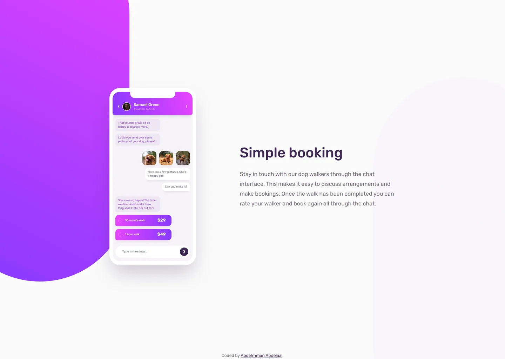

# Frontend Mentor - Chat app CSS illustration solution

This is a solution to the [Chat app CSS illustration challenge on Frontend Mentor](https://www.frontendmentor.io/challenges/chat-app-css-illustration-O5auMkFqY). Frontend Mentor challenges help you improve your coding skills by building realistic projects.

## Table of contents

- [Overview](#overview)
  - [Screenshot](#screenshot)
  - [Links](#links)
- [My process](#my-process)
  - [Built with](#built-with)
  - [Design deviations](#design-deviations)
- [Author](#author)

## Overview

### Screenshot

### Links

- Solution URL: [GitHub](https://github.com/MrBlackvanta/chat-app-css-illustration)
- Live Site URL: [Cloudflare](https://chat-app-css-illustration.abdelrhman-ahmed8881.workers.dev)

## My process

### Built with

- [Next.js 16](https://nextjs.org/) (App Router, React Compiler, Turbopack)
- [React 19](https://react.dev/)
- [TypeScript](https://www.typescriptlang.org/) (strict)
- [Tailwind CSS v4](https://tailwindcss.com/)

### Design deviations

Everything below is deliberate, with the reason. Everything else matches the Figma source; the
largest unlisted difference is 0.8px, where Rubik's real glyph advance differs from the rounded
width Figma stores on a text node.

| What                             | Design                                                                     | Built               | Why                                                                                                                                                                                                                                                                                                         |
| -------------------------------- | -------------------------------------------------------------------------- | ------------------- | ----------------------------------------------------------------------------------------------------------------------------------------------------------------------------------------------------------------------------------------------------------------------------------------------------------- |
| Placeholder colour               | `#C5C9CC`                                                                  | `#6E777D`           | 1.97:1 on the white pill fails WCAG AA. `#6E777D` is 4.57:1 and the smallest darkening that clears it, keeping the hue and saturation.                                                                                                                                                                      |
| White text on the brand gradient | `#FFFFFF` and `#D99EFF`                                                    | unchanged           | Composited against the real gradient, the 8px option labels run 3.45–4.12:1, "Samuel Green" 3.90–4.56:1 and "Available to Walk" 1.97–2.24:1. Scaling both gradient stops to 75% lightness clears every white run, but the pale violet needs 50%, which is no longer this design. The palette is left exact. |
| First message                    | desktop frame: "I'd be happy with that."; mobile: "happy to discuss more." | the mobile string   | The two design frames disagree. The mobile sentence is the better one and wraps to the same two lines in the same 128×34 bubble.                                                                                                                                                                            |
| Desktop composition              | content spans x 363–1180 of 1440, 51.5px right of centre                   | centred             | Mobile is centred 64/64, so the desktop offset reads as drift in the source rather than intent.                                                                                                                                                                                                             |
| Vertical placement               | phone centre at y 400.5 of 800                                             | y 391               | The attribution footer sits in flow and the design has no footer, so the composition centres in the height left above it.                                                                                                                                                                                   |
| Placeholder baseline             | text box 13.06px below the pill's top, 9.85px above its bottom             | line box centred    | The design's 2px nudge follows no typographic rule, and reproducing it would cost a wrapper element and a magic margin.                                                                                                                                                                                     |
| Walk options                     | ring, label and price                                                      | static list content | The phone is a picture of an app, not a form. Real radios would add four tab stops that do nothing and an unlabelled radio group.                                                                                                                                                                           |
| Header row padding               | 15.5px left, 16.5px right                                                  | 16px both           | The design's own padding is asymmetric by a pixel; centring it costs 0.5px.                                                                                                                                                                                                                                 |
| Heading below ~354px             | not specified                                                              | wraps to two lines  | Its ink is 290px wide and the mobile gutters are 32px each, so 320px leaves it 256px. The design only specifies 375px.                                                                                                                                                                                      |

## Author

- UpWork - [Abdelrhman Abdelaal](https://www.upwork.com/freelancers/mrblackvanta)
- Frontend Mentor - [@MrBlackvanta](https://www.frontendmentor.io/profile/MrBlackvanta)
- LinkedIn - [Abdelrhman Abdelaal](https://www.linkedin.com/in/abdelrhman-vanta/)
